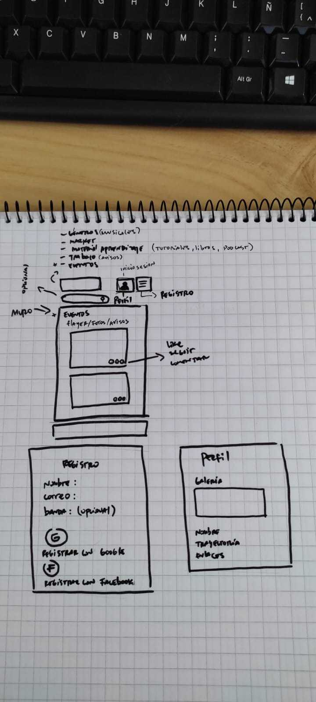
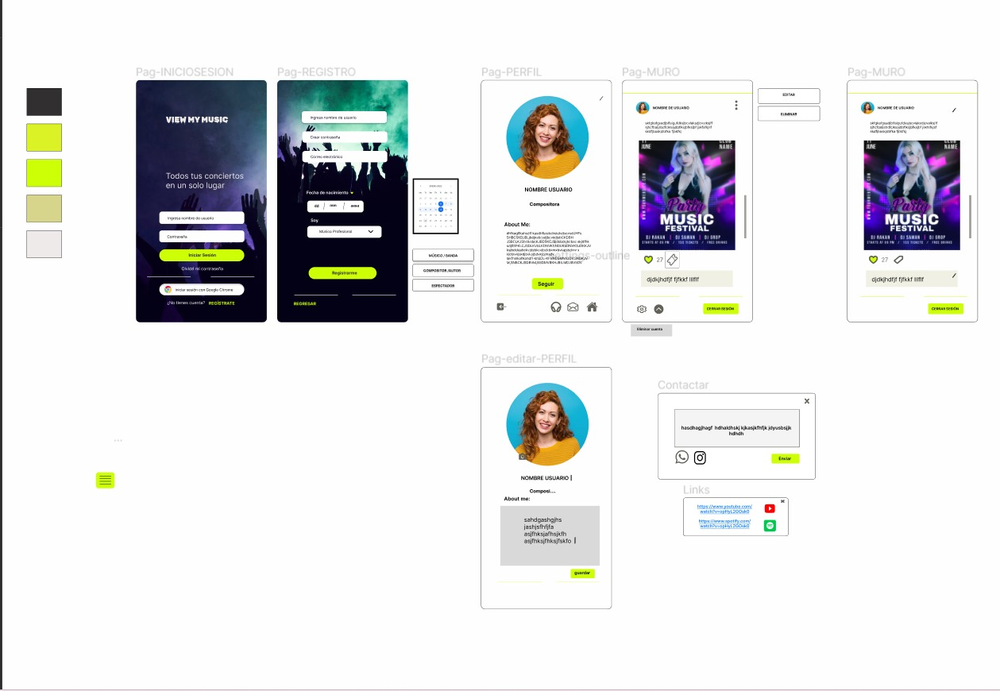

DEV002-social-network
Proyecto Social Network
VIEW MY MUSIC
Índice
1. Definición del producto
2. Principales usuarios
3. Objetivos de los usuarios en relación al producto
4. Qué problema resuelve el producto / para qué le servirá a estos usuarios
5. Prototipos
6. Historias de usuario
7. Herramientas de elaboración
8. Autoras

Sitio web
[view my music](viewmymusic.netlify.app)

1.Definición del producto
Nuestra red social es una plataforma Web y Mobile dirigida a músicos, bandas, compositores o fans, que quieran compartir flyers de sus eventos y fechas de conciertos, donde los fans podrán interactuar con los artistas. 
2. Principales Usuarios
Cualquier músico, compositor, banda o fans que quiera compartir fechas de sus eventos o simplemente fans que quieran ver el contenido que suben sus artistas.

3. Objetivos del usuario en relación al producto
Que el usuario pueda compartir sus eventos o ver eventos de otros usuarios
Que el usuario encuentre una red social que le permita postear flyers de sus eventos o comentar y ver eventos de otros usuarios.
Permitir al usuario interactuar con sus artistas favoritos.
4. Qué problema resuelve el producto / para qué le servirá a estos usuarios
Permitirá saber fechas cercanas  a eventos, descuentos de boletería, interacción con los  músicos que comparten sus eventos en la red social.
5. Prototipos
5.1 Baja Fidelidad

**5.2 Alta Fidelidad **
Mobile

Link figma: [FIGMA](https://www.figma.com/proto/8YLIS3Gmc4QWFoFUpY1DNx/Untitled?node-id=10%3A6&scaling=scale-down&page-id=0%3A1&starting-point-node-id=10%3A6&show-proto-sidebar=1)

5.3 DISEÑO FINAL PROYECTO

6. Historias de Usuario
Se utilizó la herramiento de GitHub projects 
7. Herramientas utilizadas
JavaScript
Jest
Firebase
Git
GitHub
Figm
CSS3
HTML5
Visual studio Code
8. Test de Usabilidad

9. Autoras
Brenda Moraga
Adriana Zambrano
Daniela Rocha